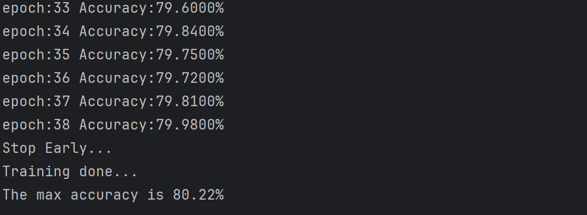

# Assignment 2
> <3210105354> <韩艺轩> <hanyixuan@zju.edu.cn>

## Part 1- sklearn

### 读取数据

```python
def unpickle(file):
    import pickle
    with open(file, 'rb') as fo:
        d = pickle.load(fo, encoding='bytes')
    return d

x_train = []
y_train = []
for i in range(1, 6):
    train_data = unpickle(os.path.join("../cifar-10-python/cifar-10-batches-py", "data_batch_{}".format(i)))
    train = train_data[b'data']
    labels = train_data[b'labels']
    x_train.extend(train)
    y_train.extend(labels)

x_train = np.array(x_train) / 255.0
y_train = np.array(y_train)
test_data = unpickle("../cifar-10-python/cifar-10-batches-py/test_batch")
x_test, y_test = np.array(test_data[b'data']), np.array(test_data[b'labels'])
x_test = x_test / 255.0
```

### 使用MLPClassifier

```python
mlp = neural_network.MLPClassifier()
```
### 训练并预测

```python
mlp.fit(x_train, y_train)
y_pred = mlp.predict(x_test)

num = 0
for i in range(len(y_pred)):
    if int(y_pred[i]) == int(y_test[i]):
        num += 1
rate = float(num) / len(y_pred)
print("The testing accuracy is {}".format(rate))

y_pred = mlp.predict(x_train)

num = 0
for i in range(len(y_pred)):
    if int(y_pred[i]) == int(y_train[i]):
        num += 1
rate = float(num) / len(y_pred)
print("The training accuracy is {}".format(rate))

print("The train score is {}".format(mlp.score(x_train, y_train)))
print("The test score is {}".format(mlp.score(x_test, y_test)))
```

### 结果


显然结果并不理想

### 探索

更新MLPClassifier的参数，选择更适合分类问题的`'sgd'`作为solver，并且启用early_stopping防止过拟合。

```python
clf = neural_network.MLPClassifier(
            hidden_layer_sizes=(100,),
            solver='sgd',
            activation="relu",
            alpha=0.0001,
            max_iter=200,
            verbose=1,
            early_stopping=True,
            tol=0.0001
        )
```

结果为


略有提升，还还有提高空间。除了分类器的问题，对数据的处理也可能会影响最终的预测准确率。

修改数据读取部分,使用hog来对输入进行特征提取。

```python
TrainData = []
TestData = []
for b in range(1, 6):
    f = os.path.join(self.filePath, 'data_batch_%d' % (b,))
    data = self.unpickle(f)
    train = np.reshape(data[b'data'], (10000, 3, 32 * 32))
    labels = np.reshape(data[b'labels'], (10000, 1))
    datalebels = zip(train, labels)
    TrainData.extend(datalebels)
f = os.path.join(self.filePath, 'test_batch')
data = self.unpickle(f)
test = np.reshape(data[b'data'], (10000, 3, 32 * 32))
labels = np.reshape(data[b'labels'], (10000, 1))
TestData.extend(zip(test, labels))

train_feat = []
test_feat = []
for data in tqdm.tqdm(TestData):
    image = np.reshape(data[0].T, (32, 32, 3))
    gray = cv2.cvtColor(image, cv2.COLOR_RGB2GRAY) / 255.
    fd = hog(gray, 9, [8, 8], [2, 2])
    fd = np.concatenate((fd, data[1]))
    test_feat.append(fd)
test_feat = np.array(test_feat)
np.save("test_feat.npy", test_feat)
print("Test features are extracted and saved.")
for data in tqdm.tqdm(TrainData):
    image = np.reshape(data[0].T, (32, 32, 3))
    gray = cv2.cvtColor(image, cv2.COLOR_BGR2GRAY) / 255.
    fd = hog(gray, 9, [8, 8], [2, 2])
    fd = np.concatenate((fd, data[1]))
    train_feat.append(fd)
train_feat = np.array(train_feat)
np.save("train_feat.npy", train_feat)
print("Train features are extracted and saved.")
```

使用特征提取后的数据进行训练

```python
clf = neural_network.MLPClassifier()
print("Training a MLP Classifier.")
clf.fit(train_feat[:, :-1], train_feat[:, -1])
predict_result = clf.predict(test_feat[:, :-1])
num = 0
for i in range(len(predict_result)):
    if int(predict_result[i]) == int(test_feat[i, -1]):
        num += 1
rate = float(num) / len(predict_result)
print('The testing accuracy is %f' % rate)

predict_result2 = clf.predict(train_feat[:, :-1])
num2 = 0
for i in range(len(predict_result2)):
    if int(predict_result2[i]) == int(train_feat[i, -1]):
        num2 += 1
rate2 = float(num2) / len(predict_result2)
print('The training accuracy is %f' % rate2)
print("The train score is {}".format(clf.score(train_feat[:, :-1], train_feat[:, -1])))
print("The test score is {}".format(clf.score(test_feat[:, :-1], test_feat[:, -1])))
```

结果准确率到达了0.5731


通过变换learning_rate模式，alpha，learning_rate_init都无法再有效提高准确度。
而且如果增加epoch，训练集上得分与测试集得分相差会越来越大，趋向于过拟合，传统机器学习的对于复杂图像的处理似乎上限就是如此。

## Part2 - Pytorch 复现 LeNet 网络

### 网络复现

由于完全复刻LeNet的卷积神经网络表现太差，这里简单修改了卷积层和线性层的一些参数。
```python
class LeNet(nn.Module):
    def __init__(self):
        super(LeNet, self).__init__()
        self.max_acc = 0.0
        self.conv1 = nn.Conv2d(3, 16, 5)
        self.pool1 = nn.MaxPool2d(2, 2)
        self.conv2 = nn.Conv2d(16, 32, 5)
        self.pool2 = nn.MaxPool2d(2, 2)
        self.fc1 = nn.Linear(32 * 5 * 5, 120)
        self.fc2 = nn.Linear(120, 84)
        self.fc3 = nn.Linear(84, 10)

    def forward(self, x):
        x = F.relu(self.conv1(x))  # input(3,32,32) output(16,28,28)
        x = self.pool1(x)  # output(16，14，14)
        x = F.relu(self.conv2(x))  # output(32,10.10)
        x = self.pool2(x)  # output(32,5,5)
        x = x.view(-1, 32 * 5 * 5)  # output(5*5*32)
        x = F.relu(self.fc1(x))  # output(120)
        x = F.relu(self.fc2(x))  # output(84)
        x = self.fc3(x)  # output(10)
        return x
```

### 训练过程

训练时如果连续5次的测试结果是非上升趋势就会终止训练。
```python
def train(model, train_dataloader, device, dataset):
    model.train()
    model.to(device)
    criterion = torch.nn.CrossEntropyLoss()
    optimizer = optim.Adam(model.parameters(), lr=0.001)
    print("Training...")
    running_loss = 0.0
    stop = 0
    pre_acc = 0.0
    for epoch in range(10):
        for step, batch_data in enumerate(train_dataloader):
            x, y = batch_data
            x, y = x.to(device), y.to(device)
            out = model(x)
            loss = criterion(out, y)
            optimizer.zero_grad()
            loss.backward()
            optimizer.step()
            running_loss += loss.item()
            if step % 200 == 0:
                print("epoch={}, step={}, loss={:5f}".format(epoch, step, float(running_loss/200)))
                running_loss = 0.0

        cur_acc = predict(model, dataset.get_test_loader(), device, epoch)
        if cur_acc < pre_acc or cur_acc - pre_acc < 0.0001 or cur_acc < model.max_acc:
            stop += 1
        else:
            stop = 0
        pre_acc = cur_acc

        if stop > 5:
            break
def predict(model, test_loader, device, epoch):
    model.to(device)
    model.eval()
    correct, total = 0.0, 0.0
    with torch.no_grad():
        for step, batch_data in enumerate(test_loader):
            x, y = batch_data
            x, y = x.to(device), y.to(device)
            outputs = model(x)
            _, predicted = torch.max(outputs.data, 1)
            total = total + y.size(0)
            correct = correct + (predicted == y).sum().item()
    cur_acc = correct / total
    print('Accuracy:{:.4f}%'.format(100.0 * correct / total))
    if cur_acc > model.max_acc:
        model.max_acc = cur_acc
        # print("Max_Acc:{}".format(model.max_acc))
        # torch.save(model, "./model/LeNet.pt")
    return cur_acc
```
测试结果准确率为69.27%


加入一层卷积层和BN层，并把epoch改成迭代50次。
```python
class LeNet(nn.Module):
    def __init__(self):
        super(LeNet, self).__init__()
        self.max_acc = 0.0
        self.conv1 = nn.Conv2d(3, 16, 3, padding=1)
        # self.conv1 = nn.Conv2d(3, 6, 5)
        self.pool1 = nn.MaxPool2d(2, 2)
        self.conv2 = nn.Conv2d(16, 32, 3, padding=1)
        # self.conv2 = nn.Conv2d(6, 16, 5)
        self.pool2 = nn.MaxPool2d(2, 2)
        self.conv3 = nn.Conv2d(32, 32, 3, padding=1)
        self.pool3 = nn.MaxPool2d(2, 2)
        self.conv4 = nn.Conv2d(32, 32, 3, padding=1)
        self.pool4 = nn.MaxPool2d(2, 2)
        self.fc1 = nn.Linear(32 * 4 * 4, 120)
        self.fc2 = nn.Linear(120, 84)
        self.fc3 = nn.Linear(84, 10)
        self.bn = nn.BatchNorm2d(32)

    def forward(self, x):
        x = F.relu(self.conv1(x))  # input(3,32,32) output(16,28,28)
        x = self.pool1(x)  # output(16，14，14)
        x = F.relu(self.conv2(x))  # output(32,10.10)
        x = self.pool2(x)  # output(32,5,5)
        x = F.relu(self.conv3(x))
        x = self.pool3(x)
        # x = F.relu(self.conv4(x))
        # x = self.pool4(x)
        x = self.bn(x)
        x = x.view(-1, 32 * 4 * 4)  # output(5*5*32)
        x = F.relu(self.fc1(x))  # output(120)
        x = F.relu(self.fc2(x))  # output(84)
        x = self.fc3(x)  # output(10)
        return x
```

结果为


### 探索

对训练数据进行数据增强,epoch设为20，数据增强如下

```python
transform_train = transforms.Compose([
            transforms.RandomCrop(32, padding=4),
            transforms.RandomHorizontalFlip(),
            transforms.ToTensor(),
            transforms.Normalize((0.5, 0.5, 0.5), (0.5, 0.5, 0.5))])
train_data = datasets.CIFAR10(root='../cifar-10-python', train=True, transform=transform_train, download=False)

```
结果又有提高


在每个卷积层后面加设一个BN层，将epoch加到50

```python
class LeNet(nn.Module):
    def __init__(self):
        super(LeNet, self).__init__()
        self.max_acc = 0.0
        self.conv1 = nn.Conv2d(3, 16, 3, padding=1)
        self.bn1 = nn.BatchNorm2d(16)
        self.pool1 = nn.MaxPool2d(2, 2)
        self.conv2 = nn.Conv2d(16, 32, 3, padding=1)
        self.bn2 = nn.BatchNorm2d(32)
        self.pool2 = nn.MaxPool2d(2, 2)
        self.conv3 = nn.Conv2d(32, 32, 3, padding=1)
        self.pool3 = nn.MaxPool2d(2, 2)
        self.bn3 = nn.BatchNorm2d(32)
        self.fc1 = nn.Linear(32 * 4 * 4, 120)
        self.fc2 = nn.Linear(120, 84)
        self.fc3 = nn.Linear(84, 10)

    def forward(self, x):
        x = F.relu(self.conv1(x))  # input(3,32,32) output(16,28,28)
        x = self.pool1(x)  # output(16，14，14)
        x = self.bn1(x)
        x = F.relu(self.conv2(x))  # output(32,10.10)
        x = self.pool2(x)  # output(32,5,5)
        x = self.bn2(x)
        x = F.relu(self.conv3(x))
        x = self.pool3(x)
        x = self.bn3(x)
        x = x.view(-1, 32 * 4 * 4)  # output(5*5*32)
        x = F.relu(self.fc1(x))  # output(120)
        x = F.relu(self.fc2(x))  # output(84)
        x = self.fc3(x)  # output(10)
        return x
```
结果最高准确率为80.22%



