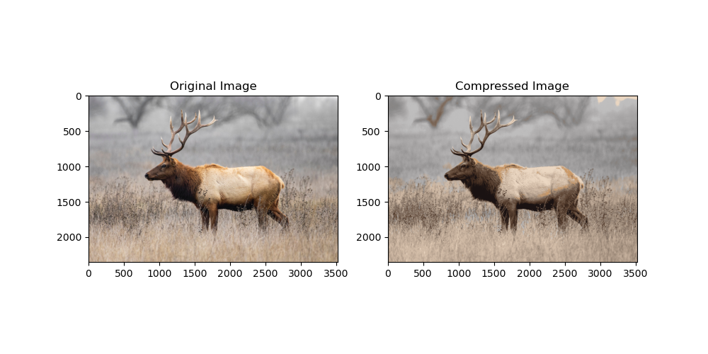

# Assignment 3 

> <3210105354> <韩艺轩> <hanyixuan@zju.edu.cn>

## Sklearn and PCA for image compression

读取图片,针对彩色图片和灰度图片做出不同操作，将所有通道的像素放入`image`中。

```python
image_raw = imread('./deer.png')

gray_chan = False
if (image_raw.ndim) == 2:
    gray_chan = True

if not gray_chan:
    img = []
    for i in tqdm(range(image_raw.shape[-1])):
        img.append(image_raw[:, :, i])
else:
    img = image_raw
```

做出主成分数量和解释方差的图，观察其关系，标出解释方差为95%，98%，99%对应的点，并显示原图。
```python
plt.subplot(1, 2, 1)
plt.imshow(image_raw)
plt.title('Original Image')
plt.axis('off')

pca = PCA()
pca.fit(img[0])

#cumulative variance
cum_variance = np.cumsum(pca.explained_variance_ratio_) * 100

#Get the number of PC whose variance > 95
k = np.argmax(cum_variance > 95)
kk = np.argmax(cum_variance > 98)
kkk = np.argmax(cum_variance > 99)
print("Number of componenets with more than 95% of variance :" + str(k))

plt.subplot(1, 2, 2)
plt.plot(np.arange(1, len(cum_variance) + 1), cum_variance)
plt.title('Cumulative Explained Variance')
plt.xlabel('Principal Components')
plt.ylabel('Cumulative Explained Variance')
plt.axvline(x=k, color="k", linestyle="--", label=str(k))
plt.axvline(x=kk, color="k", linestyle="--", label=str(kk))
plt.axvline(x=kkk, color="k", linestyle="--", label=str(kkk))
plt.axhline(y=95, color="r", linestyle="--", label="95")
plt.axhline(y=98, color="r", linestyle="--", label="98")
plt.axhline(y=99, color="r", linestyle="--", label="99")
plt.legend()

plt.tight_layout()
#
# # 显示图形
plt.show()
```

结果如下


其中计算对应 0.95 0.98 0.99的PC数的程序为

```python
var = [95, 98, 99]

components = []
for v in var:
    cum_var_list = []
    for i in range(len(img)):
        pca.fit(img[i])
        cum_variance = np.cumsum(pca.explained_variance_ratio_) * 100
        cum_var_list.append(np.argmax(cum_variance > v))
    cum_var_list = np.asarray(cum_var_list)
    components.append(cum_var_list.max())

all_num = len(cum_variance)
cnt = 1
for q, v in zip(components,  var):
    print("Optimum components for retaining {} % variance : {}".format(v, q))
```

结果为


做出三张压缩后的图片，观察效果。
```python
for k, v in zip(components,var):
    ipca = IncrementalPCA(n_components = k)
    plt.subplot(1, 3, cnt)
    cnt += 1
    plt.title('Using {} (of {}) componenets for retaining {}% variance'.format(k, all_num, v))
    if not gray_chan:
        image_reconstructed = []
        for i in range(len(img)):
            x = ipca.inverse_transform(ipca.fit_transform(img[i]))
            image_reconstructed.append(x)
        im = np.stack(tuple(image_reconstructed), axis=-1)
        im = np.clip(im, 0, 1)   # jpg/jpeg: im = np.clip(im, 0, 255).astype('uint8')
    else:
        im = ipca.inverse_transform(ipca.fit_transform(img))
    plt.imshow(im)
    plt.axis('off')
    # plt.show()

plt.tight_layout()

plt.show()
```


查看他们的内存


大幅减少内存。

## An analysis about how to use clustering for image compression.

以 K-means 为例，聚类实现图像压缩的过程大概为：

1. 选择K值： 确定聚类的数量，即K值。K值的选择通常取决于压缩后图像的颜色数量，可以手动选择或使用一些自动确定K值的方法。

2. 初始化簇中心： 随机选择K个像素作为初始簇中心，每个像素表示一个颜色。

3. 分配像素到簇： 对图像中的每个像素，计算其与K个簇中心的距离，并将其分配到距离最近的簇。

4. 更新簇中心： 对每个簇，计算其所有分配到该簇的像素的平均值，并将其作为新的簇中心。

5. 重复步骤3和步骤4： 反复执行步骤3和步骤4，直到簇中心不再改变或达到预定的迭代次数。

6. 代表色替换： 将原始图像中的每个像素替换为其所属簇的中心颜色。这样，压缩后的图像中每个像素都表示一个代表色。

### 简单实现

```python
import numpy as np
import matplotlib.pyplot as plt
from sklearn.cluster import KMeans
from skimage import io

# 读取图像
image = io.imread('deer.png')

# 获取图像的形状和像素值
height, width, channels = image.shape
pixels = image.reshape((height * width, channels))

# 设置聚类数量
k = 16

# 使用K均值聚类
kmeans = KMeans(n_clusters=k)
kmeans.fit(pixels)

# 获取簇中心和标签
centers = kmeans.cluster_centers_
labels = kmeans.labels_

# 将图像像素替换为簇中心颜色
compressed_image = centers[labels].reshape((height, width, channels))

# 显示原始图像和压缩后的图像
plt.figure(figsize=(10, 5))

plt.subplot(1, 2, 1)
plt.imshow(image)
plt.title('Original Image')

plt.subplot(1, 2, 2)
plt.imshow(compressed_image.astype(np.uint8))
plt.title('Compressed Image')

plt.show()
```

结果为


大小为


## 比较
K-means在压缩时更加有效的压缩了大小，但是会使图片的色彩区分度降低。
而PCA虽然在大小上的压缩不如K-means，但差距不大，且能保存原有的色彩鲜明。